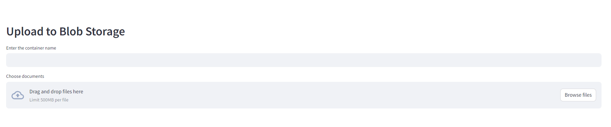
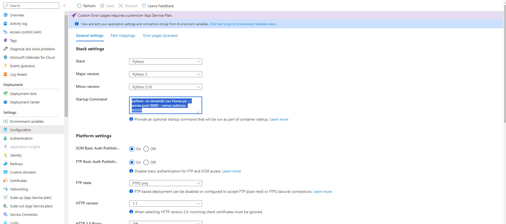

# Upload file to Blob Storage

## Guide

### Run locally

- Python 3.7+ is required
- Create a virtual environment:
```bash
python -m venv venv
```
- Activate the virtual environment: 
```bash
source venv/bin/activate
```
- Install requirements: 
```bash
pip install -r requirements.txt
```
- Make .env file: 
```bash
cp .env.example .env
``` 
- Get the required values in the Azure Portal and fill the .env
```ini
BLOB_ADMIN_TOKEN=
BLOB_URL=
```
- Run the following command to start the server
```bash
streamlit run Home.py
```
- Enter a container name for uploading



### Deploy to Web App

Follow the following guide with VSCode to deploy the app:

https://learn.microsoft.com/en-us/azure/app-service/quickstart-python?tabs=flask%2Cwindows%2Cvscode-aztools%2Cazure-cli-deploy%2Cdeploy-instructions-azportal%2Cterminal-bash%2Cdeploy-instructions-zip-azcli

On Azure Portal Configuration site, set Startup Command to: `python -m streamlit run Home.py --server.port 8000 --server.address 0.0.0.0`



